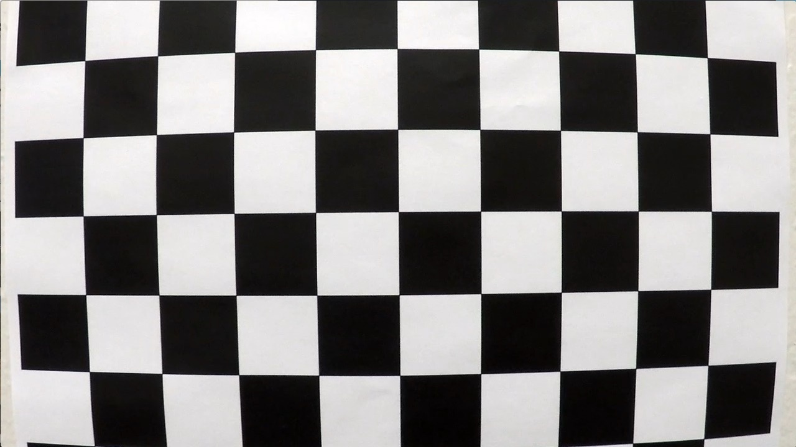

### Project-2 -  Advanced Lane Finding Project
---

[//]: # (Image References)

[image1]: ./output_images/test_calibration_after.jpg "After Calibration"
[image2]: ./output_images/test_calibration_before.jpg "Before Calibration"
[image3]: ./output_images/image3.png "Binary thresholded image"
[image4]: ./output_images/image4.png "Perspective transform"
[image5]: ./output_images/image5.png "Identify lane lines"
[image6]: ./output_images/image6.png "Lane lines mapped"
[video1]: ./output_video.mp4 "Video"

This project contains multiple steps which are as below.
* Camera calibration: Using a set of given Chessboard images, Compute the camera calibration matrix and distortion coefficients.
* Distortion Correction: Correct distortion to given set of images.

<table style="width:100%">
  <tr>
    <th>
      

           
            Test image before calibration
      

    </th>
    <th>
      

           
            Test image after calibration
      

    </th>
  </tr>
</table>

* Thresholding : Create a threshold binary image using gradients or color transformation or combination of both.
* Perspective Transform: Create bird-eye view like image by applying perspective transform.
* Detect lane pixels and fit to find the lane boundary.
* Determine the curvature of the lane and vehicle position with respect to center.
* Warp the detected lane boundaries back onto the original image.
* Output visual display of the lane boundaries and numerical estimation of lane curvature and vehicle position.