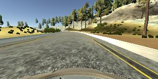
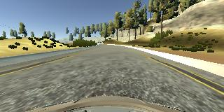
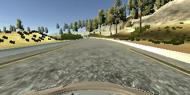
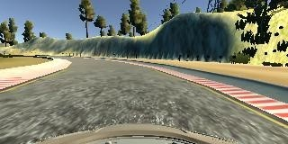
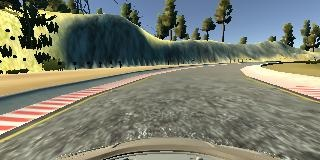

### Project-4 -  Behaviour Cloning
---
[//]: # (Image References)

[image1]: ./images/center_line.jpg
[image2]: ./images/center_steering.png
[image3]: ./images/model.png
[video1]: ./output_video/video_fps_60.mp4

The goal of the project was to train a Deep Neural Network to replicate the human steering behavior. The network is basically a CNN. More details to follow on the architecture.
The end goal is to train the network so that it can drive the car on given path on the simulator provided by Udacity.

#### Model Architecture

The model/architecture used in this project is borrowed from a [paper by Nvidia](https://arxiv.org/pdf/1604.07316v1.pdf). This model is basically a CNN but not in a conventional way. 

Below is the architecture of the model. This model was chosen for this project as it has documented success in predicting steering angle of the car based on the given image. 
![Nvidia Model Architecutre][image3]

The architecture consists of a convolution neural network with 2x2 filter sizes and depths between 24 and 64.
The model includes RELU layers to introduce nonlinearity, and the data is normalized in the model using a Keras lambda layer. The lambda layer basically makes sure that all the inputs to the model is between the range of [-1,1].
#### Data Collection and Processing
Data for this task can be generated and collected with the Udacity simulator itself with Training Mode. 
When in training mode, the car is controlled by the human, and frames and steering angles are stored to local storage to be used further.

Creation of data happened in 3 different phases and each phase was meant to mitigate the issue from
the previous approach. They are as follows.

1. Recorded data with expected driving behavior in the center of the track. Model trained on
this was doing just fine but was not doing good in sharp corners.
2. To overcome that issue, I recorded some more data which had only sharp corners and
appended it to the previous one. This model was nearly as expected but if the car drifts
outside the driving area, it was not able to come back.
3. To solve that issue, I recorded data where I am driving in cross pattern and trying to get the
car back in to center lane. This final model seems to work just fine.

Please find below the pre-processing steps for the data.

- Normal Center Line

![Normal Center Line Image][image1]

- Recovery lap images. From right to center line.  

<table style="width:100%">
  <tr>
    <th>
      

           
            Extreme right
      

    </th>
    <th>
      

           
            Closer to center
      

    </th>
        <th>
      

           
            Back to Center
      

    </th>
  </tr>
</table>

After all the data collection, we checked the distribution of the steering angle over collected data.
it was clear that, the data has a lot of samples for left hand side curve angles. Please find below the steering angle distribution.

![Steering angle distribution][image2]

So augmentation was necessary to compensate enough data for the right side curve so that the model can generalize better.
To augment the data, we basically flipped some of the right hand steering angled images. Please find the example below.
Please note here that with flipping of images, steering angles are also flipped.

<table style="width:100%">
  <tr>
    <th>
      

           
            Original right turn image
      

    </th>
    <th>
      

           
            Flipped to left turn image
      

    </th>
  </tr>
</table>

####Preventing overfitting

Despite the strong data augmentation mentioned above, there's still chance that the model is overfitting. 
In order to prevent the network from overfitting, dropout layers are added after each convolutional layer (drop prob=0.2) and after each fully-connected layer (drop prob=0.5) but the last one.

####Testing of the trained model
After training the model on all the data gathered from the simulator, we deploy it and test it on the simulator itself where the simulator is not in training mode. The model performs pretty well. 
Please refer to this [video][video1] for the visual representation of the performance of the model. 